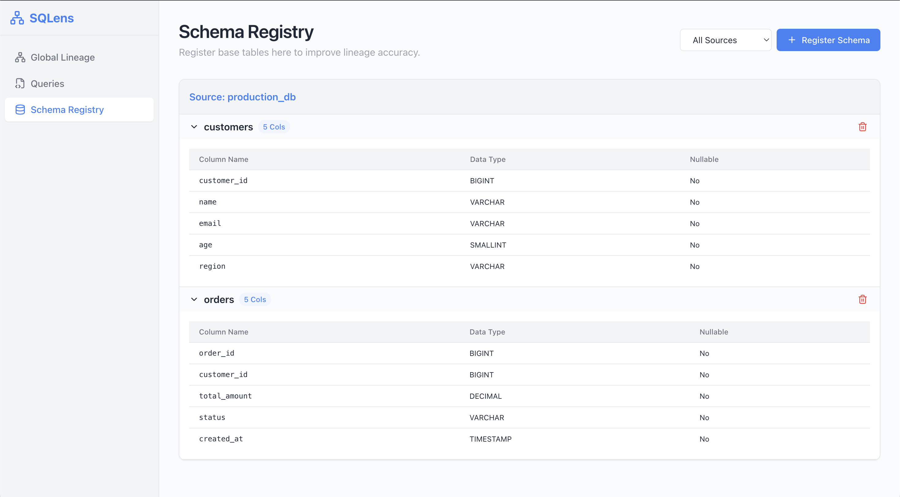
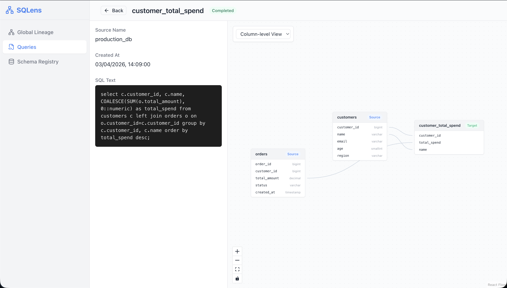
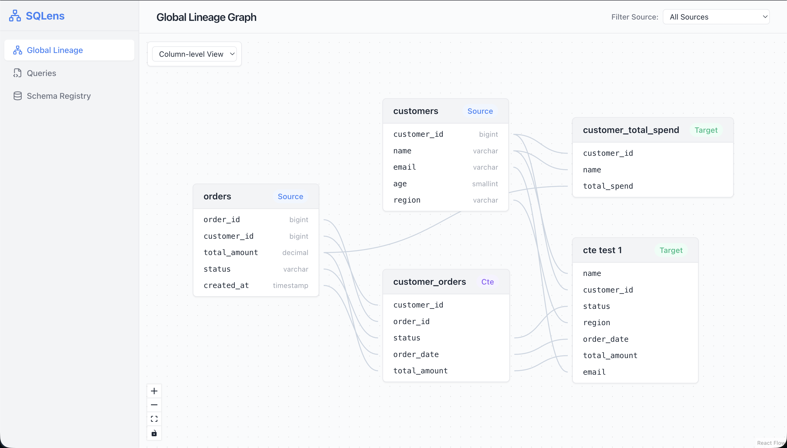
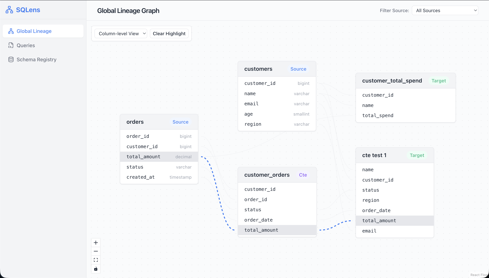

# SQLens Lineage Dashboard

An interactive React frontend for the SQLens lineage service, built with Vite, React Flow, and TanStack Query.

## Features

- **Global Lineage Graph:** Interactive DAG mapping all queried SQL models and tables.
- **Column & Table Level Views:** Toggle between collapsed table nodes or expanded column mapping nodes.
- **Query Submission & Listing:** View historical query analytics and trigger backend lineage parsing dynamically.
- **Schema Management:** Pre-register physical tables into the registry to strengthen ambiguity resolution.

## How to run

### 1) Start the Backend

The frontend expects the Altimate SQLens backend to be running on port `8000`.

```bash
cd ../Altimate
uvicorn app.main:app --reload
```

### 2) Install Dependencies (Frontend)

Navigate to this frontend directory and install NPM packages:

```bash
npm install
```

### 3) Start the Dev Server

```bash
npm run dev
```

The frontend will start running on [http://localhost:5173](http://localhost:5173).

> **Note on CORS:** The Vite development server uses an embedded proxy (configured in `vite.config.js`) to automatically route all calls starting with `/api` towards `http://localhost:8000`. You do not need to alter backend CORS policies to work locally!

## Screenshots

### Schema Registry

Register base tables and browse their column metadata grouped by data source.



### Query Detail — Column-Level Lineage

Inspect individual SQL queries with a column-level lineage graph showing exactly which source columns map to each output column.



### Global Lineage Graph

A full interactive DAG of all parsed SQL models and their table/column relationships.



### Column Highlight

Click any column to highlight its complete upstream lineage path across the graph.


